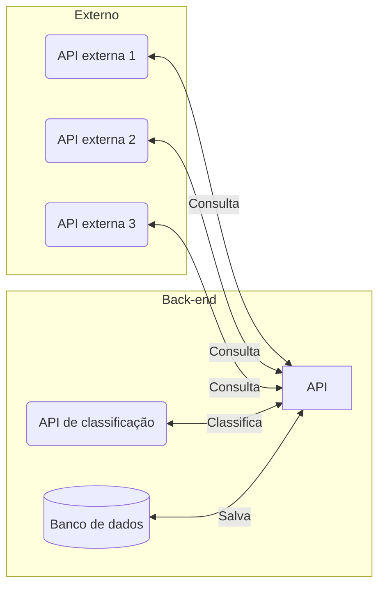

# Integrações com APIs lentas

| Author | Date | Topics |
|-|-|-|
| @jjpaulo2 | 27-04-2025 | `queue`, `messagery`, `database`, `API`, `monitoring` |

## Introdução

Imagine que você possui o seguinte cenário abaixo.

