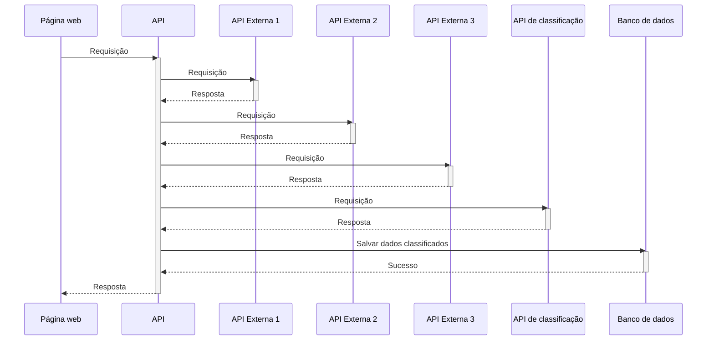

# Integrações com APIs lentas


| Author | Date | Topics |
|-|-|-|
| @jjpaulo2 | 27-04-2025 | `queue`, `messagery`, `database`, `API`, `monitoring` |

## Introdução

Você é desenvolvedor em um time de uma empresa de consultoria financeira. A empresa pretende lançar uma aplicação de controle e recomendação de gastos para contas de bancos. Para tal, será necessário fazer consulta em 3 APIs dos bancos digitais e uma API interna para classificar os dados para o usuário.

Imagine a API foi pensada inicialmente da forma a seguir.

```mermaid
flowchart BT
    web_page@{ shape: procs, label: "Página web"}
    subgraph Externo
        direction LR
        external_api_1(API externa 1)
        external_api_2(API externa 2)
        external_api_3(API externa 3)
    end
    subgraph Back-end
        direction RL
        api[API]
        classifier_api(API de classificação)
        db[(Banco de dados)]
    end

    style api fill:#044

    web_page <-->|Consulta| api
    classifier_api <-->|Classifica| api
    db <-->|Salva| api
    external_api_1 <-->|Consulta| api
    external_api_2 <-->|Consulta| api
    external_api_3 <-->|Consulta| api
```



Uma página web consulta a sua API numa busca por resultados, mas esta busca depende de 3 consultas em APIs externas, um enrequecimento interno em uma API de classificações, e um registro em banco de dados.

A ordem em que as operações são executadas é mostrada abaixo.



Abaixo há um exemplo de dados enviados para a nossa API.

```json
{
    "id": "xxx",
    "initialDate": "xx/xx/xxxx",
    "finalDate": "xx/xx/xxxx"
}
```

Abaixo há um exemplo de dados retornados pela nossa API.

```json
{
    "id": "xxx",
    "expenses":
    [
        {
            "categoryId": "xxx",
            "categoryName": "Food",
            "purchaseId": "xxxx",
            "moneySpent": "xxxx",
            "purchaseDate": "xx/xx/xxxx hh:mm:ss"
        }
    ]
}
```

### Problema

- As APIs dos parceiros podem ficar fora do ar e apresentar lentidão, quando isso ocorre o uso completo da solução fica indisponível;
- Para históricos com janela de tempo requisitado grande e/ou com muitas transações o tempo de resposta se torna longo. Isso afeta não só o cliente que faz essa requisição como os outros clientes utilizando a aplicação;
- Consultas feitas ao banco de dados apresentam muita lentidão, dificultando a consulta e análise de dados, bem como atrasando o troubleshooting em algumas situações.